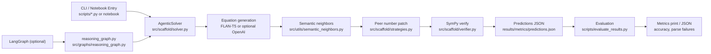
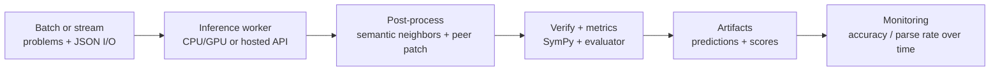

# LLM Reasoning Scaffold

A clean, end-to-end **agentic learning** pipeline for math word problems (MAWPS-style): local **FLAN-T5** equation generation, **sentence-transformer** semantic neighbors, **numeric peer patching** when outputs fail SymPy validation, and a thin **LangGraph** orchestration layer with optional **OpenAI** calls.

[](.github/workflows/ci.yml)

## Executive Summary

This repository is designed as a portfolio-grade **LLM systems** example aligned with a senior practitioner background (Physics PhD, 10+ years in data science). It emphasizes the engineering discipline expected in applied ML and LLM teams: modular architecture, reproducibility, tests that avoid heavy model downloads, and clear separation between library code and notebooks.

**What reviewers should notice quickly:**

* End-to-end workflow from MAWPS JSON through equation prediction, SymPy verification, and metric computation
* Reusable package-first implementation under `src/scaffold/`, `src/graphs/`, and `src/utils/`
* Notebook as a **consumer** layer, not a dumping ground for core logic
* Script entrypoints for batch experiments and baseline evaluation without GPUs (`evaluate_results.py` on checked-in predictions)
* Baseline snapshot predictions plus regeneration path for apples-to-apples comparisons

## Scope

This project demonstrates how to:

* Load structured MAWPS-style datasets (`data/raw/`)
* Combine generation (FLAN-T5 or optional OpenAI) with semantic retrieval and rule-based repair
* Evaluate predicted equations against gold with SymPy equivalence
* Run the same logic through **LangGraph** for inspectable, phase-based workflows

## Structure

* `data/raw/` — MAWPS train/test JSON used by experiments  
* `results/metrics/` — prediction JSON, baseline snapshots, optional metric dumps  
* `src/scaffold/` — prompts, strategies, solver, verifier, evaluator, LangGraph-related **shared state**  
* `src/graphs/` — compiled LangGraph workflow (`understand_problem` → … → `summarize_result`)  
* `src/integrations/` — optional OpenAI client (no key → local path only)  
* `src/utils/` — I/O, logging, semantic neighbor helpers  
* `scripts/` — data checks, run experiments, evaluate accuracy  
* `notebooks/` — article-aligned reproduction walkthrough  
* `docs/` — model governance and notes (see [Documentation artifacts](#documentation-artifacts))  
* `templates/` — reusable experiment logging template  

## Goal

Show a **production-style** approach to building LLM-assisted systems — not just ad hoc notebooks: scripts and packages own behavior; notebooks document and drive the same APIs.

## Engineering Highlights

* Clear separation of concerns (prompting, solving, verification, graph wiring, I/O)
* Reusable Python packages under `src/` (importable after `pip install -e .`)
* Thin notebook layer that calls the same code paths as `scripts/`
* Command-line entrypoints for reproducible batch runs and fast baseline checks
* Test suite that validates parsing, patching, and verification **without** downloading Hugging Face weights in CI

## Architecture



Core solving behavior lives in `src/scaffold/solver.py` and is reused by `scripts/run_experiment.py` and the LangGraph builder.

## Optional cloud / production pattern (conceptual)



**How this repo maps**

* `scripts/run_experiment.py` → batch inference job (local or containerized)
* `scripts/evaluate_results.py` → offline evaluation harness (golden labels vs predictions)
* `.env` + `src/integrations/openai_client.py` → optional hosted LLM path with explicit fallback
* `docs/model_card.md` → terse governance summary for the solver stack
* `templates/experiment_log_template.md` → experiment traceability for reruns and comparisons

## Quickstart

```bash
make setup
make run
make check
```

Or run directly:

```bash
source .venv/bin/activate
pip install -r requirements.txt
pip install -e .
python scripts/generate_data.py
python scripts/evaluate_results.py
```

Full regeneration (downloads models on first run):

```bash
python scripts/run_experiment.py
python scripts/evaluate_results.py --predictions results/metrics/predictions.json
```

Notebook:

```bash
jupyter notebook notebooks/01_article_reproduction.ipynb
```

## OpenAI (optional)

Copy `.env.example` to `.env` and set `OPENAI_API_KEY` if you want to try cloud generation (`python scripts/run_experiment.py --use-openai`). Without a key, the stack uses local models and rule-based peer patching.

## LangGraph

`src/graphs/reasoning_graph.py` exposes `build_reasoning_graph(solver)` after `solver.load()`. It mirrors the same solver used in `scripts/run_experiment.py` so graph runs stay aligned with batch experiments.

## Quality and Tooling

```bash
.venv/bin/python -m black src tests scripts
.venv/bin/python -m ruff check src tests scripts
.venv/bin/python -m pytest -q
```

Configuration lives in `pyproject.toml` (`pytest`, optional formatter/linter via `[project.optional-dependencies]` dev extras).

## Reproducibility

* Checked-in baseline predictions: `results/metrics/article_baseline_predictions.json` vs `data/raw/mawps_test.json` recovers article-aligned numbers without re-downloading weights (see `REPRODUCTION.md`).
* `scripts/generate_data.py` validates that required MAWPS JSON files are present.
* Single documented command order in `REPRODUCTION.md` and `make run` for the no-model baseline path.

## Environment

* **Recommended Python:** `3.10+` (`requires-python` in `pyproject.toml`)
* Install dependencies from `requirements.txt`
* CI runs on Ubuntu with Python `3.10`

## Limitations

* MAWPS subset and article snapshot are for **demonstration and reproduction**, not a claim of SOTA on all MWP benchmarks
* Default path uses a modest local generator (FLAN-T5-base); quality tradeoffs are intentional for portability
* Fairness, calibration across demographics, and production drift monitoring are out of scope for this scaffold

## Roadmap

* Tighter integration tests around `AgenticSolver` with mocked generation (where practical)
* Optional export of evaluation runs to a lightweight experiment database or folder convention
* Clearer abstractions for swapping encoders or peer-ranking policies

## Documentation artifacts

* Reproduction steps and article alignment: `REPRODUCTION.md`
* Model card (solver, data, metrics): `docs/model_card.md`
* Experiment template: `templates/experiment_log_template.md`
* Optional API configuration: `.env.example`

## License

MIT 
